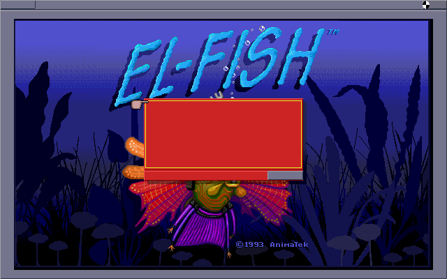

# El-Fish Static Recompilation

Static recompilation of **El-Fish** (1993, AnimaTek/Maxis, DOS) v1.01 for Windows 11.

## Project Status: Runs, and draws its title screen



That is the recompiled `ELFISH.EXE` running as a native Windows program: 640x400x256
through a VESA banked framebuffer, the palette uploaded through the DAC ports, drawn
by the game's own lifted code. No emulator, no DOSBox.

Startup runs **1,938 distinct functions** deep and ends in the game's keyboard/timer
poll loop, waiting for input. On the way it loads `ELFISH.RED`, reads and rewrites
`ELFISH.INS`, probes the DOS file-handle limit, initialises the mouse, detects VESA,
sets mode 0x100, and loads `XX_MDR.DLL` and `\SYSTEM\EPICTURE.DBP`.

Capture a frame yourself:

```bash
ELFISH_DUMP_FB=title.ppm build/elfish_test.exe
python tools/ppm2png.py title.ppm title.png
```

### What's Done
- All 121 code segments lifted to C — **15,213 functions**, ~**299K lines** in `src/`
- Relocations resolved, including the **additive** ones whose addend selects an entry
  of a multi-entry thunk (268 sites that otherwise land on the wrong function)
- **IDA-driven disassembly** (`analysis/ida_funcs.json`) reconciled against relocations,
  branch targets and code pointers, which are ground truth about instruction boundaries
- DOS services: file I/O, directory and attribute calls, time/date, free space
- TSXLIB: memory alloc/free with real reclaim, `int86x` (ordinal 32) and DPMI
  simulate-real-mode-interrupt (ordinal 72)
- BIOS: INT 10h text and palette calls, VBE 1.2 (one mode, banked window), INT 16h
  keyboard against the host console, INT 33h mouse
- A VGA register file — CRTC, sequencer, graphics, attribute, DAC — that reads back
  what was written, because the driver checks
- CMake/Ninja build → `elfish_test.exe`, link-clean

### Remaining Work (prioritized)
| Issue | Count | Status / Plan |
|-------|-------|---------------|
| **x87 instructions dropped** | **17,355** | The decoder names only 1,574 of the FPU ops; the rest come out as `esc_N` and are lifted to a comment. Segments 225/228-231 are the fish genetics and rendering engine, so almost none of the actual simulation runs yet. Biggest single gap. |
| No display or input yet | — | The framebuffer is real memory and can be dumped; it needs an SDL2 window, and the keyboard needs wiring to it |
| Sound | — | Not started: AdLib/SB/MT-32 via `XX_MDR*.DLL` |
| Unresolved call targets | 96 | Emitted as stubs that do nothing but clean up the caller's stack frame |
| Dropped out-of-function branches | 42 | Targets that are not instruction boundaries, almost all inside FPU-emulation trampolines |

**Memory model:** selectors are normalized to NE segment indices; `gen_image.py` builds a flat
image (`build_data/mem_image.bin`) placing each segment at `SEG_SEGMENT_BASE[n]` with all 12,320
internal relocations applied. `seg_off()` translates selector→base at runtime; unmapped selectors
hit an isolated guard region.

**Relocation chaining (fixed):** NE relocations are a chained linked list — each record stores
only the head offset, and the pre-relocation word at each fixup location points to the next
location needing the same fixup, until `0xFFFF`. `build_reloc_map` now walks the full chain
through segment data (non-additive relocations), recovering all fixup sites.

### Executable Analysis

| Metric | Value |
|--------|-------|
| Format | NE (16-bit segmented), self-loading protected mode |
| File size | 797,592 bytes |
| Code segments | 121 (508 KB total code) |
| Data segments | 110 |
| Functions detected | 772 (697 far) |
| Instructions | 214,516 |
| Relocations | 25,394 (4,022 internal, 21,372 imports) |
| Runtime | TSXLIB v5.10 (AnimaTek's protected-mode DOS runtime) |
| TSXLIB ordinals used | 33 unique (21K+ call sites) |

### Program Architecture

Only 12 of 121 code segments directly call TSXLIB — the system layer is thin and well-contained.

**Core Math / Fish Engine** (FPU-heavy, ~175KB):
| Seg | Size | FPU ops | Role |
|-----|------|---------|------|
| 231 | 53KB | 6,580 | Fish evolution/genetics (self-recursive, largest function 5.6KB) |
| 230 | 48KB | 7,341 | Fish rendering/animation |
| 229 | 35KB | 2,869 | Physics/movement calculations |
| 228 | 27KB | 956 | Fish shape generation |
| 225 | 18KB | 2,371 | Rendering math helper |

**Game Logic / UI** (~78KB):
| Seg | Size | Role |
|-----|------|------|
| 227 | 26KB | Main game logic/UI hub (most cross-segment connections) |
| 226 | 19KB | UI/display manager |
| 224 | 17KB | Object/resource manager |
| 223 | 17KB | Scene/aquarium manager |

**System Layer** (TSXLIB wrappers, ~25KB):
| Seg | Size | Role |
|-----|------|------|
| 166 | 1.5KB | Segment manager |
| 157 | 1KB | File I/O wrapper |
| 151 | 790B | Memory management |
| 211 | 5.7KB | Resource loader |
| 209 | 5KB | Startup/main entry |
| 112 | 8.4KB | Low-level runtime |

### TSXLIB Runtime API

99.4% of TSXLIB imports are FPU emulation trampolines (ordinals 22-24). Only 44 actual system calls across these categories:
- **FPU emulation** (22-24): 21,252 call sites — translates to native C `double` ops
- **Memory management** (55-68): `malloc`/`free`/`realloc`/`lock` equivalents
- **File I/O** (36-75): `open`/`read`/`write`/`close`/`seek`
- **Segment management** (20-31): Protected-mode segment loading
- **System** (32-49): DOS interrupt dispatch, interrupt handlers, port I/O

### Lifted Code Stats

| Metric | Value |
|--------|-------|
| Source files | 121 (one per code segment) + generated dispatch/stubs |
| Functions | 15,213 real, 96 unresolved stubs |
| Lines of C | 299,380 |
| x87 instructions lifted | 1,574 of 18,929 (the rest decode as `esc_N`) |
| Unique functions reached at runtime | 1,938 |
| Lifting errors | 0 |

### Building

```bash
mkdir build && cd build
cmake ..
cmake --build .
```

### What's Next
1. **Decode the remaining x87 instructions.** 17,355 come out as `esc_N` and lift to a
   comment, which is most of the maths in the fish engine. Nothing simulates until this does.
2. **SDL2 window** for the framebuffer that already exists, and route its keyboard and
   mouse into the INT 16h/33h handlers.
3. Work through the title screen: the dialog box draws but its text does not — INT 10h
   AH=11 (get font pointer) has nothing to point at yet.
4. The `XX_MDR*.DLL` driver system, which the game opens but we do not load.
5. Sound.

### Other Executables

| File | Size | Format | Purpose |
|------|------|--------|---------|
| `ELFISH.EXE` | 798 KB | NE | Main application |
| `VIEWER.EXE` | 318 KB | NE | Tank/aquarium viewer |
| `PCONVERT.EXE` | 112 KB | NE | Palette converter |
| `AUTODEMO.EXE` | 25 KB | MZ | Auto-demo TSR |
| `MCONVERT.EXE` | 64 KB | MZ | Converter utility |
| `XX_MDR*.DLL` | 11-18 KB | Custom | Sound/video drivers |

## Game Technical Details
- 16-bit DOS, protected mode via TSXLIB, requires 386+, 4MB RAM
- VGA (376×348) and SVGA (640×400) via VESA 1.2
- Sound: AdLib, Sound Blaster, SB Pro, Roland MT-32, Pro Audio Spectrum, PC Speaker
- Custom DLL system for sound/video drivers (`XX_MDR*.DLL`, `*.MIR`)
- Install layout: `ARTWORK\`, `FISH\`, `SYSTEM\`, `AQUARIUM\`

## Project Structure
```
src/           — 121 lifted C source files (one per code segment)
runtime/
  cpu.h        — CPU + FPU state, memory access, flags, condition codes
  segments.h   — 1,501 cross-segment function prototypes (auto-generated)
  main.c       — Entry point (placeholder)
  tsxlib_stubs.c — TSXLIB runtime stub implementations
tools/
  ne_parse.py  — NE executable format parser
  ne_decode.py — NE-aware disassembler with x87 FPU decoding
  ne_lift.py   — NE-aware x86-to-C lifter with FPU support
  fpu_decode.py — Full x87 FPU instruction decoder
  tsxlib.py    — TSXLIB ordinal-to-C function mapping
  ne_xref.py   — Cross-reference and call graph builder
  ppm2png.py   — Framebuffer dump (PPM) -> PNG, stdlib only
analysis/      — Generated analysis outputs
CMakeLists.txt — Build system
```

## Toolchain
Uses [pcrecomp](https://github.com/sp00nznet/pcrecomp) as the base 16-bit recompilation pipeline, extended with NE format support:
- `decode16.py` — 16-bit x86 instruction decoder (pcrecomp)
- `lift16.py` — Base x86-to-C lifter (pcrecomp)
- `ne_*.py` / `fpu_decode.py` / `tsxlib.py` — NE format extensions (this project)
- `recomp16/` — Runtime library (pcrecomp, to be adapted)

## Related
- [pcrecomp tools](https://github.com/sp00nznet/pcrecomp) — Static recompilation toolbox
- Civilization recomp (similar 16-bit DOS, 1991) — reference project, reached 482 functions / 132K lines
